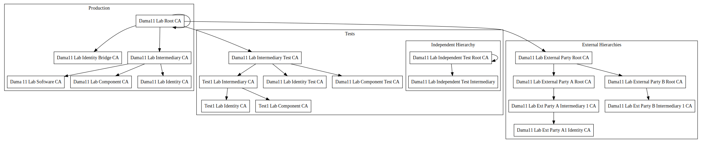

## Content
This project consists of Linux shell scripts - some of them are meant to be run from inside 
 the terminal by the user, some of them exist to be called from other
 scripts. Additionally, there is also a number of expect scripts:
 
### Linux scripts for the user

[//]: # (https://stackoverflow.com/questions/4823468/comments-in-markdown)
[//]: # (https://meta.stackexchange.com/questions/72395/is-it-possible-to-have-definition-lists-in-markdown)
* [change_ca_password.sh](../change_ca_password.sh)  
  This script changes the password for the private key of a certificate
  authority. The old private key is backed up prior to 
  creation of the new key with the new password.
  
  Parameters for the script:
  * *-k file name for private key file of the CA*
    The file containing the private key of the CA
  * *-l*
    refresh CRL
  * *-d directory name to copy CRL to*
    The directory where the resulting CRL should be placed (only used if -l is set)
  * *-h*
    Print some help text
* [create_ca.sh](../create_ca.sh)  
  This script lets the user create a CA. It asks for the kind of CA
  (Root, Intermediate, ...) and some configuration options. Then, it builds
  a directory structure and populates it with the necessary files.
  Finally, a certificate signing request (CSR) is created

  Parameters for the script:
  * *-t offline template dir*
    The script initially tries to download the expert pki unless this parameter specifies an already downloaded version
  * *-k pre-existing key file*
    A key pair is created for the new CA unless there is already a preexisting key file - in this case, it has to be specified here
  * *-c type of CA*
    The script skips the dialog for choosing the type of CA about to be created if the value given here is one of the types offered by the expert PKI project (at the time of writing these are: root|component|network|identity|software)
  * *-n name of CA*
    The name of the CA about to b created. This skips the dialog asking vor it. The name must not contain special characters such as whitespace or umlaute etc.
  * *-l key length*
    The length in bits of the key to be created (if no preexisting key is given, see above). If this value is given here as one of the supported values 1024|2048|4096 the corresponding dialog is skipped.
  * *-a <hash algorithm>*
    The message digest algorithm to be used. If this value is given here as one of the supported values md5|sha1|sha224|sha348|sha512|sha256 the corresponding dialog is skipped.
  * *-p*
    Skip specification of CPS
  * *-o*
    Skip specification of custom OIDs
  * *-g*
    Generate template for ca_presets.ini and stop execution afterwards
  * *-h*
    Print some help text
* [install_ca_certificate.sh](../install_ca_certificate.sh)  
  This script takes the certificate produced by the certificate authority
  for the new CA and installs it in the correct place inside the directory structure.

  Parameters for the script:
  * *-z location of zip file holding the certificate*
    The file with the deliverables in it that the CA sent back
  * *-d directory name to copy CRL to*
    The directory where the resulting CRL should be placed
  * *-h*
    Print some help text
* [manage_certs.sh](../manage_certs.sh)  
  This script lists all certificates ever issued by this CA and their 
  current state or - if a date is given - all valid certificates with 
  an end date of their validity befor this given date.
* [refresh_crl.sh](../refresh_crl.sh)  
  This script renews the Certificate Revocation List 
  of the 
  current Certificate Authority: 
  Inside crls there is always 
  information about the end of its validity. A crls validity period is always 
   limited. The PKI or CA is responsible for refreshing the CRL before
   the validity of the last one is up. This script offers
   a convenient method of doing so.

  Parameters for the script:
  * *-k file name for private key file of the CA*
    The file containing the private key of the CA
  * *-d directory name to copy CRL to*
    The directory where the resulting CRL should be placed
  * *-h*
    Print some help text
* [reneq_cert_req.sh](../reneq_cert_req.sh)  
  This script issues a CSR for renewal of a soon to be expiring certificate:
  If the private key should stay the same - thats the option to choose!
* [request_certificate.sh](../request_certificate.sh)  
  This script is for end users: They can use it in conjunction with
  configuration files provided by the CA to request a certificate. It creates
  the appropriate CSR from a private key provided by the user. If she has none, the
  private key can be generated as well.

  This script runs without a GUI so as to put as few dependencies and preconditions
  in the way of a user getting her certificate.

  Parameters for the script:
  * *-k file name for key file*
    If this file exists, the key in it is used - if it does not exist, a new key is generated and saved to it
  * *-c file name of config file*
    The config file containing information about the contents and structure of the certificate signing request to be built
  * *-o file name of resulting CSR*
    The file the new certificate signing request is to be saved in
  * *-h*
    Print some help text
* [request_certificate_renewal.sh](../request_certificate_renewal.sh)  
  *This script is obsolete - due to a bug in openssl, the extensions as well as the subject alternative names
  are not copied from the certificate into the CSR - users should use standard openssl commands for creating
  CSRs from existing private keys for renewal of certificates!*
  This script is for end users: They can use it to renew their certificate - meaning to
  extend the validity of an already obtained certificate from the same 
  certificate authority. To do so, the user must have her old certificate as well as
  her private key (and the password for unlocking it) available.
  
  This script runs without a GUI so as to put as few dependencies and preconditions
  in the way of a user getting her certificate.
  
  Parameters for the script:
  * *-k file name for key file*
    If this file exists, the key in it is used - if it does not exist, a new key is generated and saved to it
  * *-c file name of old certificate*
    The file containing the old certificate that should be renewed
  * *-o file name of resulting CSR*
    The file the new certificate signing request is to be saved in
  * *-h*
    Print some help text
* [revoke_crl.sh](../revoke_crl.sh)  
  This script shows all currently valid certificates. The user 
  can choose one of them. The user is then asked to choose one of the available
  reason for the revocation. After a final display of the choosen certificate and a
  positive answer to the security question to make sure the user
  is aware of the consequences, this certificate is then revoked and the certificate revocation list 
  (CRL) is also updated accordingly. The certificate itself is moved from the folder holding
  all active issued certificates (_certs_) into a folder holding all issued and revoked certificates named
  _certs/revoked_.

  Parameters for the script:
  * *-d directory name to copy CRL to*
    The directory where the resulting CRL should be placed
  * *-h*
    Print some help text
* [sign_request.sh](../sign_request.sh)  
  This script takes a CSR and creates a certificate for it after
  presenting the CSR to the user in a human-readable form and asking
  for confirmation.
  
  
  Parameters for the script:
  * *-k file name for key file*
    If this file exists, the key in it is used - if it does not exist, a new key is generated and saved to it
  * *-s file name of the CSR to work on*
    A file containing the certificate signing request to be processed
  * *-s file name of the CSR to work on*
    A file containing the certificate\n\t\tsigning request to be processed\n"
  * *-d*
    The calendar dialog for choosing the validity end of the certificate is preset to this date"
  * *-m* 
    The calendar dialog for choosing the validity end of the certificate is preset to this date (only if -M ist *NOT* specified!)"
  * *-y* 
    The calendar dialog shows a date the given amount of years in the future - taking into account the values for -m and -d if given"
  * *-M* 
    The calendar dialog shows a date the given amount of months in the future - taking into account the value for -d if given"
  * *-h*
    Print some help text
* [work_on_csrs.sh](../work_on_csrs.sh)  
  This script takes a directory and searches for all files with suffix
  ".csr" in it. With each such file found it calls [sign_request.sh](../sign_request.sh)
  and after this script has finished, it moves the CSR to a subdirectory named _done_.
  This subdirectory is created if it does not yet exist. That way, the
  handling of CSRs can be interrupted and continued later on.
  
  Parameters for the script:
  * *-k file name for private key file of the CA*
    The file containing the private key of the CA
  * *-d directory containing the CSRs to work on*
    All files found inside this directory with suffix \".csr\" are processed as certificate signing request
  * *-h*
    Print some help text
### Linux helper scripts
* [build_p12.sh](../build_p12.sh)  
  This script is added to all the files delivered to an end entity after creating the certificate
  using [sign_request.sh](../sign_request.sh): It allows the end
  entity to easily create a .p12-file from all the deliverables (certificate and
  full certificate chain) combined with her private key: all she
  has to do is call the script in the directory  containing it, giving the
  location of the private key file as its sole parameter. The script
  then asks for the private key password and for a password to protect the new .p12-file
  (twice - for safeguarding against typos) and finally prints
  out the location of the created .p12-file with its full (absolute) path. 
* [ask_for_password.sh](../ask_for_password.sh)  
  This script is sourced by all scripts needing the user to specify 
  a new secret pasword. It displays the usual "please give new password/please type it
  again to verify"-GUI and does basic verification:
  * are both fields non-empty
  * are password and password verification equal
  *Please note that passwords must be at most 254 characters long*
* [configure_gui.sh](../configure_gui.sh)  
  This script is sourced by all other scripts used on the issuer side of
  things. It sets some basic environment bariables needed in all the scripts
  and does some other supporting stuff too.
* [logging.sh](../logging.sh)
  This script is sourced by all scripts having to write log messages to syslog. It offers
  a function to do so named `debug2Syslog`.
* [updateCRLs.sh](../updateCRLs.sh) 
  This script searches recursively for all CAs in or below the current directory.
It asks the user for a date - then it changes
  into each CA directory found and checks if the validity of the current CRL
ends before the choosen date. If this is the case, it then calls [refresh_crl.sh](../refresh_crl.sh) - this 
  updates the CRL of the CA in question - providing the correct path to the corresponding
  private key automatically. This way, one only hass to give the matching passwords to
  unlock each private key when needed. This can be a huge time saver when a PKI with lots of CAs
  has to be managed
* [copyCRLs.sh](../copyCRLs.sh)
  This script searches recursively for all CRLs in or below the current directory. All CRLs
  found are then copied into the target directory (to facilitate the upload of the certificates 
  to a HTTP server for example). If no target directory is specified when starting the script,
  a file chooser dialog is displayed. 
  Parameters for the script:
  * *-d target directory to copy the CRLs to*
    All CRLs found inside any of the subdirectories of the current directory are copied to this directory.
  * *-h*
    Print some help text.
* [structure_dot.sh](../structure_dot.sh)
  This script searches recursively for all CA certificates in or below the current directory.
  It extracts some information from them - mainly the parent child relationships between issuer 
  and issued certificates and processes this information to write a GraphViz _.dot_ file. This
  file when rendered provides a visual representation of the relationships of the certificates like 
  in this example here:
  

### Expect scripts
These scripts are needed to hide the complexities of calling and interacting with the openssl 
command line program. They automate the interactive process when using the openssl
executable to manipulate components of the PKI
* [ca_csr.xpct](../ca_csr.xpct)
* [ca_csr_with_key.xpct](../ca_csr_with_key.xpct)
* [cange_ca_password.xpct](../cange_ca_password.xpct)
* [gen_crl.xpct](../gen_crl.xpct)
* [priv_key_fingerprint.xpct](../priv_key_fingerprint.xpct)
* [req_from_cert.xpct](../req_from_cert.xpct)
* [revoke_cert.xpct](../revoke_cert.xpct)
* [sign_csr.xpct](../sign_csr.xpct)
* [sign_csr_dry.xpct](../sign_csr_dry.xpct)

