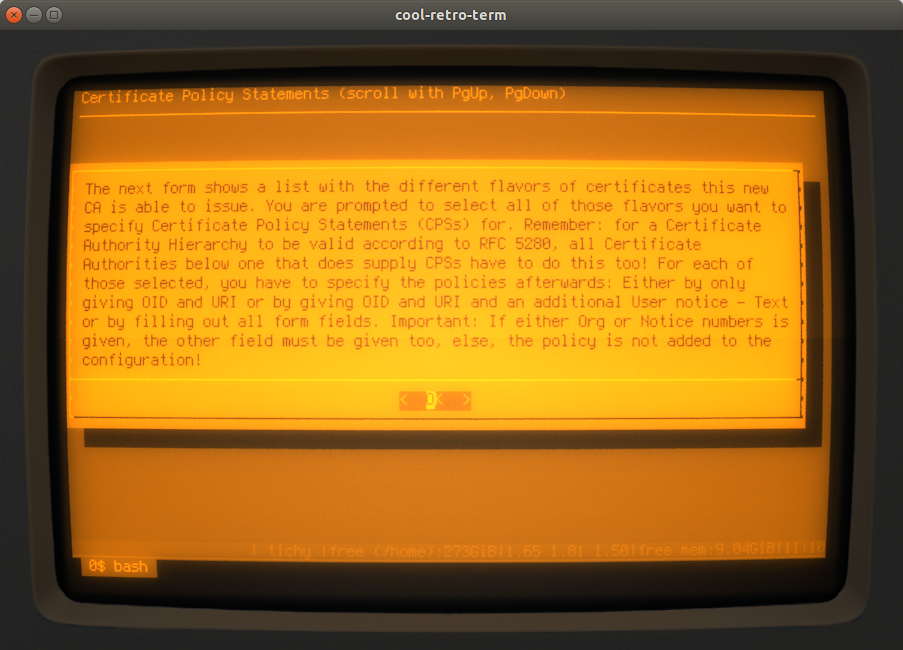

## How can i customize my CA?

Before running `create_ca.sh`, it is probably a good idea to set some defaults. You do
that by editing a file called _ca_presets.ini_.
This file has to reside in the current directory. Its format is `key="value"`. The double quotes can be
omitted if the value does not contain spaces. Allowed keys at this time are:

* countryName
  used for the subject data and for the default values for config items
  in end user configs (see below)
* organizationName
  used for the subject data and for the default values for config items
  in end user configs (see below)
* organizationalUnitName
  used for the subject data and for the default values for config items
  in end user configs (see below)
* commonName
  used for the subject data
* base_url
  used for the configuration of the CA - everywhere where an URL is needed;
  for example location of CA certificate, CRL,...
* stateOrProvinceName
  used in end user configs (see below)
* localityName
  used in end user configs (see below)

A template for this file can be generated by calling `create_ca.sh` with command line
switch `-g`.

After starting `create_ca.sh`, you are asked first for the type of the CA. the available types are 
fetched from the templates. an example for the choices available may look like this:

The next step is to enter the name of the CA. This is at the same time
the name of the directory all files belonging to this new CA are put into. So make sure there
is no file or directory with this name in the current directory. Also do not use the following names:

* root
* network
* identity
* component
* software

After that, the script asks for the URL of the associated OCSP responder. If you do not want or have one,
just leave that field blank - otherwise, you must enter a valid URL for accessing the responder here!

Now, the script shows the information read from _ca_presets.ini_ (if applicable):

And the user can afterwards change / enter the Distinguishes Name for the CA:

The next step is the specification of the key length:

and the hash or message digest algorithm:

Now, the script informs you about the possibilities to enter default values for Certificate
Signing Requests (CSRs). Each CA offers different flavours of certificates it can issue. For each of 
these, the script generates a config file to facilitate the creation of CSRs. And each
of these config files can have default values set for the fields inside the distinguished name.
Setting default values makes it a little easier and more convenient for end entities to 
create CSRs.

It is not necessary to specify such defaults for all flavours - you can choose which ones 
you want:

If you choose at least one - a dialog like this one here is displayed to enter the default values:

Afterwards, you are informed that you can specify Certificate Policy Statements (CPSs)
for each flavour:

It is not necessary to specify CPSs for all flavours - you can choose which ones
you want:

If you choose at least one - a dialog like this one here is displayed 
to let you enter the information for each CPS:

The next step is to define any custom OIDs you want to use while working with this 
new CA. You are informed about that possibility like so:

The dialog for entering identifier, OID and description is repeatedly shown as long as all three fields
are filled - giving you the opportunity to enter an arbitrary number of custom OIDs. The script
does not allow to re-use an already entered identifier or OID:

Now, you have to enter a password to protect the private key of the CA:

The next step is to specify the location for the log:

Then, the certificate signing request is displayed:

And that concludes the process - the script shows some informational messages to wrap it all up:

